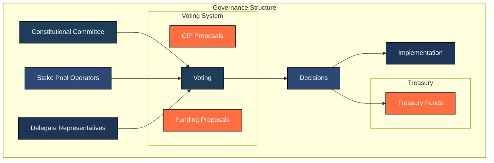
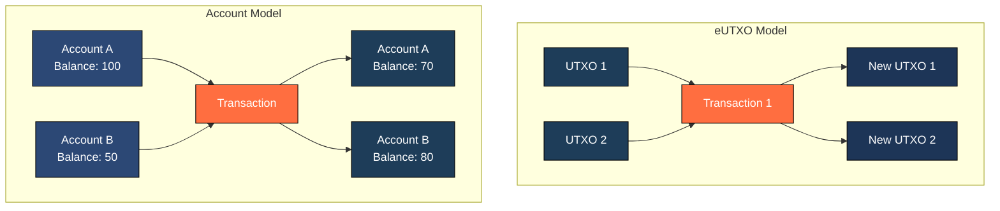
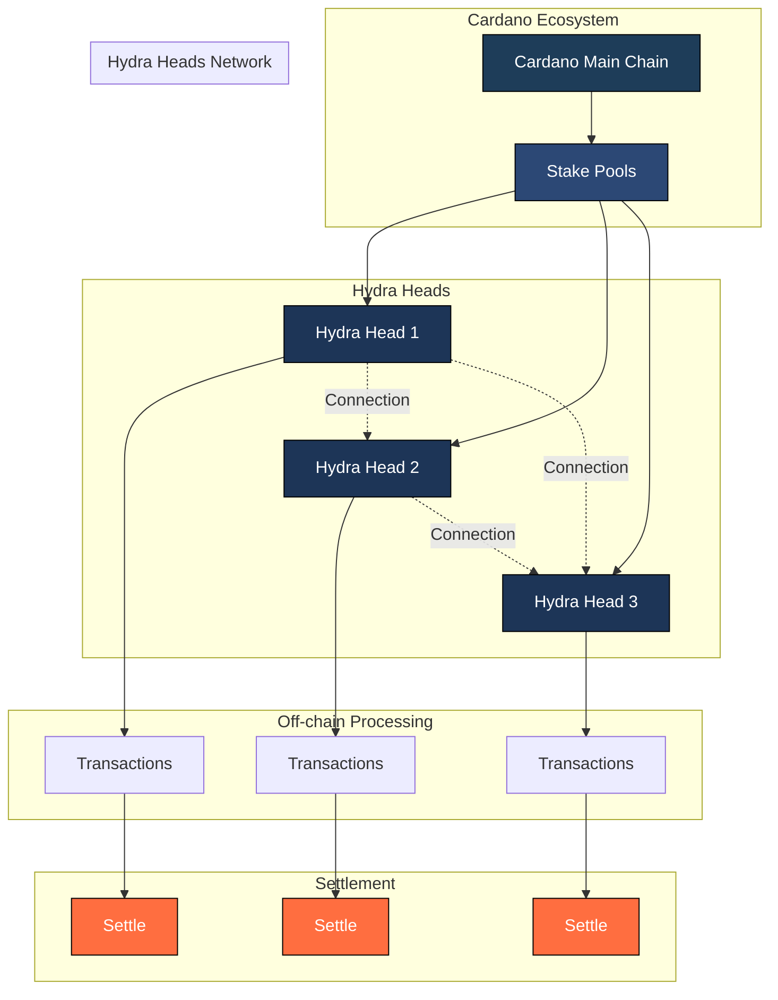

# Cardano Advocacy Document

## Table of Contents
- [What is Cardano?](#what-is-cardano)
- [The Strengths of Cardano](#the-strengths-of-cardano)
  - [Academic Peer Review Approach](#academic-peer-review-approach)
  - [Stake Pool Operations](#stake-pool-operations)
  - [Cardano Native Tokens](#cardano-native-tokens)
  - [On-chain Governance](#on-chain-governance)
  - [Cross-chain Interoperability](#cross-chain-interoperability)
  - [Performance and Low Fees](#performance-and-low-fees)
- [Technical Architecture](#technical-architecture)
  - [eUTXO vs Account-Based Blockchains](#eutxo-vs-account-based-blockchains)
  - [Comparison with Other Blockchains](#comparison-with-other-blockchains)
  - [Smart Contracts Security](#smart-contracts-security)
- [Opportunities for Cardano](#opportunities-for-cardano)
  - [Midnight](#midnight)
  - [Hydra L2](#hydra-l2)
  - [Argentina Adoption](#argentina-adoption)
  - [Quantum Resistance](#quantum-resistance)
- [Challenges of Cardano](#challenges-of-cardano)
  - [Governance Improvement](#governance-improvement)
- [Examples of Cardano Projects](#examples-of-cardano-projects)
  - [World Mobile](#world-mobile)
  - [AGIX (SingularityNET)](#agix-singularitynet)
  - [Dedium](#dedium)
  - [Palmyra](#palmyra)
  - [NMKR](#nmkr)
  - [FluidTokens](#fluidtokens)
  - [Iagon](#iagon)
- [Conclusion](#conclusion)

## What is Cardano?

Cardano is a third-generation, open-source blockchain platform that aims to provide a more secure and scalable infrastructure for the development of decentralized applications and smart contracts. It is built on a philosophy of peer-reviewed research and aims to balance scalability, security, and sustainability. Cardano uses the Ouroboros proof-of-stake protocol, which is designed to be energy-efficient compared to traditional proof-of-work systems.

## The Strengths of Cardano

### Academic Peer Review Approach

Cardano distinguishes itself with its commitment to academic rigor. All major updates and changes to the protocol undergo peer review by leading academics, ensuring that the development is based on sound scientific principles. This approach is meant to prevent common issues seen in other blockchains like technical debt and security vulnerabilities.

For example, IOHK, an engineering company responsible for building the Cardano blockchain platform, has been involved in peer review and have a [comprehensive library of Cardano scientific research papers](https://iohk.io/en/research/library/).

### Stake Pool Operations

Stake Pool Operators (SPOs) play a vital role in Cardano's decentralized network by maintaining and operating the nodes that validate transactions and produce new blocks. This system is fundamental to Cardano's proof-of-stake consensus mechanism.

#### Key Aspects of Stake Pool Operations
- **Decentralization**: Anyone with the technical knowledge and hardware requirements can run a stake pool, contributing to network decentralization.
- **Delegation System**: ADA holders can delegate their stake to pools, earning rewards without running their own infrastructure.
- **Liquid Staking**: ADA holders can stake their tokens in pools, contributing to the network's total stake without locking them up.
- **Pool Saturation**: Built-in mechanisms prevent any single pool from becoming too large, promoting a balanced distribution of stake.
- **Community Engagement**: Many SPOs actively contribute to the Cardano ecosystem through education, tools development, and community support.

### Cardano Native Tokens

Cardano native tokens are digital representations of assets that exist on the Cardano blockchain. These assets can be anything from fiat currency to energy credits. They are created and transacted directly on the blockchain, without the need for smart contracts, making them unique compared to other blockchains.

#### Key Characteristics
- **Native to Cardano**: Cardano native tokens are minted and exist solely on the Cardano blockchain, utilizing its ledger and infrastructure.
- **Fungible and Non-Fungible**: Native tokens can be both fungible (replaceable with another identical token) and non-fungible (unique and indivisible), allowing for a wide range of use cases.
- **Decentralized**: Cardano native tokens are decentralized, meaning that there is no central authority controlling their creation, distribution, or ownership. The absence of smart contracts ensures that the tokens have no backdoor or malicious intent.
- **Security**: Transactions involving Cardano native tokens are secured by the Cardano blockchain’s proof-of-stake (PoS) consensus algorithm, ensuring the integrity and immutability of the ledger.

### On-chain Governance

Cardano's governance model is designed to be decentralized and community-driven, formalized through the Cardano Constitution and implemented via CIP-1694. This comprehensive framework ensures democratic participation in the network's evolution and decision-making processes.

Here is a high-level overview of the governance system:

#### The Cardano Constitution

The Cardano Constitution, signed in Buenos Aires, Argentina, serves as the foundational document for Cardano's governance system. It outlines:

- **Core Principles**: Establishes shared values, guiding principles, and governance rules for the ecosystem
- **Tricameral System**: Defines roles for Stake Pool Operators (SPOs), Delegate Representatives (DReps), and the Constitutional Committee
- **Legal Framework**: Provides guidelines for Treasury management, financial policies, and governance mechanisms
- **Evolution Process**: Designed as a living document that can adapt to community needs through structured amendment processes

[Constitution reference](https://docs.intersectmbo.org/cardano/cardano-governance/cardano-constitution)

#### Governance Implementation

The governance system includes several key components:

- **Treasury System**: A portion of consensus rewards is set aside in a treasury for community-proposed initiatives
- **On-chain Voting**: Token holders participate in governance through direct voting or delegation
- **Constitutional Committee**: Elected body responsible for constitutional interpretation and governance oversight
- **Cardano Improvement Proposals (CIPs)**: Community-driven proposals for technical improvements
- **Funding Proposals (FPs)**: Specific project funding requests from the treasury
- **Delegate Representatives (DReps)**: Elected officials who vote on behalf of delegating token holders

#### Current Status

The Constitution was approved by 60 out of 63 delegates at the Constitutional Convention in Buenos Aires and Kenya. It awaits on-chain ratification by DReps in January 2025, marking a significant step toward Cardano's vision of a decentralized digital nation-state.

### Cross-chain Interoperability

Cardano's approach to cross-chain interoperability focuses on creating secure and efficient bridges between different blockchain ecosystems. This strategy aims to enhance blockchain connectivity while maintaining the security and reliability that Cardano is known for. Through various initiatives and partnerships, Cardano is building a comprehensive interoperability framework that will allow seamless interaction between different blockchain networks.

#### Partner Chains
In November 2023, Cardano began introducing sidechains, referred to as "partner chains". These partner chains are designed to perform off-chain computations, known as smart contracts, while using the Cardano network for settlement. The first example of such a chain, named "Midnight", will utilize the Polkadot framework in combination with Cardano.

#### Polkadot Partnership
Cardano and Polkadot have announced a strategic partnership, leveraging Polkadot's Substrate framework to build out Cardano's partner chain project. This collaboration will enable Cardano to expand its reach across Web3 and showcase Substrate's potential for other chains and ecosystems.

#### Native Bridges and User Experience

Cardano’s native bridges enable seamless asset transfer between the Cardano blockchain and other EVM-compatible chains, such as Ethereum, Binance Smart Chain, and Polygon. These bridges are designed to be decentralized, non-custodial, and bi-directional, allowing for secure and efficient cross-chain transactions.

Their is also bridges with other UTXO blockchains, such as Bitcoin, that allow creating smart contracts on Cardano that are executed on Bitcoin.

- Fluide Token
- Bitcoin OS

### Performance and Low Fees

Cardano’s design prioritizes performance, scalability, and low fees, making it an attractive option for users and developers. The predictable fee structure, prevention of DDoS attacks, and future scalability plans all contribute to a robust and efficient blockchain platform.

- **Predictable and generally lower transaction fees**: Cardano’s fee structure is designed to be predictable and lower compared to centralized exchanges. There are no percentage-based trading fees on peer-to-peer transactions, making it more cost-effective for large-volume traders.

- **Minimal fees for transactions**: The minimal fees for a transaction are calculated according to a formula, which includes constants ‘a’ and ‘b’ and the size of the transaction in bytes. At the moment, the constants have values that result in a minimum fee of 0.155381 ADA, with an additional cost of 0.000043946 ADA per byte of transaction size.

- **Prevention of DDoS attacks**: The transaction fee formula includes a parameter ‘a’ to prevent DDoS attacks. Even small dummy transactions are designed to cost enough to deter attackers who try to generate thousands of them.

- **Future scalability and fee reduction**: The implementation of Hydra, a Layer 2 solution, is expected to scale the Cardano network to 1,000,000 Tx/s and bring down fees to a sustainable level.

- **Low operating costs**: As a proof-of-stake (PoS) network, Cardano’s operating costs are significantly lower compared to proof-of-work (PoW) networks like Bitcoin. This reduces the pressure to increase transaction fees and ensures a more stable and predictable fee structure.

- **Treasury and governance**: Cardano’s treasury is funded by transaction fees and is used to power innovation and development. The treasury is also subject to governance, ensuring that the community has a say in how fees are allocated and used.

## Technical Architecture

### eUTXO vs Account-Based Blockchains

eUTXO (Extended Unspent Transaction Output) and Account-Based blockchains are two different models used to process and record transactions on a blockchain. The eUTXO model is an extension of the UTXO (Unspent Transaction Output) model, which is used by blockchains like Bitcoin, while the Account-Based model is used by blockchains like Ethereum.

**Key Differences**:

- **UTXO Model**: 
  - Transactions consume previous UTXOs and create new ones, similar to cash transactions
  - Each UTXO can only be spent once and must be consumed entirely
  - Multiple UTXOs can be combined in a single transaction
  - Change from a transaction creates a new UTXO
  - Provides better privacy as new addresses can be generated for each transaction

- **Account-Based Model**:
  - Uses a global state of account balances
  - Each account has a single balance that gets updated
  - Transactions modify the state of multiple accounts
  - Simpler to understand and implement
  - More familiar to traditional banking systems

**Advantages of eUTXO**:
- **Parallelization**: Multiple UTXOs can be processed simultaneously, improving scalability
- **Deterministic**: Transaction outcomes are predictable as they only depend on their inputs
- **Enhanced Security**: Each UTXO can only be spent once, reducing the risk of double-spending
- **Better Privacy**: New addresses for each transaction make it harder to track user activity
- **Improved Smart Contracts**: Extended functionality allows for more complex smart contract scenarios while maintaining determinism

**Advantages of Account-Based**:
- **Simplicity**: Easier to understand and implement
- **State Management**: Direct state tracking for smart contracts
- **Familiar Model**: Similar to traditional banking, making it more intuitive for users
- **Lower Storage Requirements**: Only stores current balances rather than transaction history
- **Easier Integration**: More straightforward to integrate with existing financial systems

**Why Cardano Chose eUTXO**:
- Better scalability through parallel transaction processing
- More predictable fees and transaction outcomes
- Enhanced security and privacy features
- Ability to extend the model for complex smart contracts while maintaining determinism
- Natural support for multi-asset transactions

### Comparison with Other Blockchains

Cardano's approach to smart contracts prioritizes security through formal verification methods and a robust programming model. This comprehensive approach helps ensure that contracts behave as intended, significantly reducing the risk of bugs and hacks that have plagued other platforms.

#### Formal Verification
- **Mathematical Proofs**: Smart contracts can be mathematically proven to behave correctly according to their specifications
- **Plutus**: Built on Haskell, a functional programming language known for its strong type system and ability to catch errors at compile-time
- **Property-Based Testing**: Automated testing that verifies contract behavior across a wide range of possible inputs

#### Security Features
- **Deterministic Execution**: Smart contracts on Cardano always produce the same output for the same input, eliminating unpredictable behavior
- **No Reentrancy Attacks**: The eUTXO model naturally prevents reentrancy attacks, a common vulnerability in account-based systems
- **Explicit State Management**: Clear and predictable state transitions make it easier to reason about contract behavior
- **Resource Limits**: Built-in mechanisms prevent infinite loops and resource exhaustion attacks

#### Development Tools
- **Plutus Playground**: Interactive development environment for testing smart contracts before deployment
- **Static Analysis**: Tools that analyze code for potential vulnerabilities before execution
- **Simulation Framework**: Ability to simulate contract execution in various scenarios

#### Best Practices
- **Modular Design**: Encourages breaking down complex contracts into smaller, verifiable components
- **Standard Templates**: Verified contract templates for common use cases
- **Audit Trail**: Transparent history of contract interactions and state changes
- **Upgrade Paths**: Safe mechanisms for updating contracts when necessary

#### Plutus vs Solidity Smart Contracts

Cardano's Plutus and Ethereum's Solidity represent two fundamentally different approaches to smart contract development, each with its own strengths and trade-offs.

**Language Design**:
- **Plutus**: 
  - Based on Haskell, a purely functional programming language
  - Strong static typing catches errors at compile time
  - Immutable data structures prevent state-related bugs
  - Higher-level abstractions enable more concise and safer code

- **Solidity**:
  - Imperative programming language similar to JavaScript
  - Dynamic typing can lead to runtime errors
  - Mutable state makes code more prone to bugs
  - More familiar syntax for mainstream developers

**Execution Model**:
- **Plutus**:
  - eUTXO model provides deterministic execution
  - Parallel execution of non-conflicting transactions
  - Script context is explicit and well-defined
  - State changes are validated before execution

- **Solidity/EVM**:
  - Sequential execution of transactions
  - Global state can lead to race conditions
  - Implicit transaction context
  - State changes happen during execution

**Security Considerations**:
- **Plutus**:
  - Formal verification built into the development process
  - No reentrancy attacks due to eUTXO model
  - Explicit handling of assets and tokens
  - Predictable execution costs

- **Solidity/EVM**:
  - Vulnerable to reentrancy attacks
  - Complex gas estimation
  - Implicit handling of assets
  - Common vulnerabilities like integer overflow

**Developer Experience**:
- **Plutus**:
  - Steeper learning curve due to functional programming
  - Better tooling for formal verification
  - More rigorous development process
  - Comprehensive testing frameworks

- **Solidity/EVM**:
  - Easier to learn for JavaScript developers
  - Large ecosystem of tools and libraries
  - More community resources available
  - Faster development cycle

### Smart Contracts Security

**Key Aspects**:

- **Formal Verification**: Mathematical proofs ensure contract correctness
- **Deterministic Execution**: Predictable outcomes reduce unexpected behavior
- **Strong Type System**: Helps catch errors at compile time
- **Domain-Specific Language**: Plutus is designed for financial applications

**Advantages over Other Platforms**:

- More rigorous security guarantees
- Reduced risk of common vulnerabilities
- Better suited for high-value financial applications
- More predictable gas fees
- Easier to audit and verify
- More community resources available
- Faster development cycle

## Opportunities for Cardano

### Midnight

Midnight is a data-protection blockchain designed to safeguard sensitive commercial and personal data. It is built on top of the Cardano (ADA) ecosystem and utilizes zero-knowledge (ZK) proofs to enable programmable data protection. This allows developers to build decentralized applications (DApps) that can transact sensitive information while maintaining data integrity, similar to Web2 platforms.

Key features of Midnight include:

1. Data protection: Midnight uses ZK proofs to shield sensitive data, enabling selective disclosure and compliance with regulatory requirements.
2. Programmable data protection: Developers can define custom data protection policies using TypeScript-based smart contracts.
3. Shielded ledger: Midnight maintains a separate ledger for shielded transactions, keeping sensitive data private.
4. Unshielded ledger: The blockchain also maintains an unshielded ledger for public transactions, ensuring transparency and auditability.
5. Integration with Cardano: Midnight is a partner chain, meaning it can leverage Cardano’s user base, developers, and investors to distribute its token and grow its ecosystem.

Midnight aims to address the limitations of traditional blockchain technology in terms of data protection and regulatory compliance, making it more suitable for commercial and enterprise adoption. Its design enables organizations to engage in selective disclosure, a functionality that has been lacking in blockchain technology until now.

### Hydra L2

Hydra is a Layer 2 (L2) scaling solution for the Cardano (ADA) blockchain, designed to improve transaction speed and throughput while minimizing costs. Its primary goal is to address scalability concerns by allowing the network to process more transactions per second without compromising security or decentralization. Recent tests have demonstrated Hydra's impressive capabilities, achieving over 1 million transactions per second (TPS), surpassing its initial target and setting a new standard for blockchain scalability.

Here’s a breakdown of Hydra's key features:

1. Extension of the Cardano network: Hydra is built on top of the existing Cardano blockchain, leveraging its security and decentralization.
2. Off-chain processing: Hydra enables most transactions to be processed off-chain, reducing the load on the main chain and increasing throughput.
3. Isomorphic state channels: Hydra introduces the concept of “isomorphic state channels,” which are off-chain ledger siblings connected to both each other and the main chain. Each channel, called a “Head,” can support native assets, non-fungible tokens (NFTs), and Plutus scripting.
4. Flexible fee structure: Hydra allows for a different fee/cost structure and timing constraints on Layer 2, enabling more efficient and cost-effective transactions.
5. Security and decentralization: Hydra maintains the security and decentralization of the Cardano network, ensuring that transactions are verified and settled on-chain.

Hydra’s architecture enables:

- Faster transaction processing: By offloading transactions to Layer 2, Hydra increases the network’s overall throughput and reduces latency.
- Lower costs: With a more efficient fee structure and reduced on-chain transactions, Hydra minimizes costs for users.
- Scalability: Hydra’s design allows for easy expansion of the network, enabling it to handle increased transaction volumes without compromising security or decentralization.

### Argentina Adoption

**Partnership with Entre Ríos Province**: The Cardano Foundation has announced a strategic partnership with the Entre Ríos Province in Argentina to boost blockchain adoption. The partnership was signed in a public ceremony between Rogelio Frigerio, the governor of Entre Ríos, and Rafael Fraga, the LATAM Business Development Lead of the Cardano Foundation. This collaboration aims to facilitate blockchain adoption in the province, leveraging Argentina's technological strengths to deliver efficient crypto services.

**Historical Significance**: Buenos Aires holds a special place in Cardano's history as the city where the Cardano Constitution was signed. This significant event marked a crucial milestone in Cardano's journey towards decentralization and community governance, further cementing Argentina's importance in the Cardano ecosystem.

**Government Support**: Argentina's government has been actively exploring the adoption of blockchain and cryptocurrencies. The country's National Securities Commission (CNV) has partnered with El Salvador's National Commission of Digital Assets (CNAD) to explore Bitcoin adoption and crypto regulation. This collaboration is expected to benefit from Argentina's experience in adopting blockchain technology.

**Cardano’s Commitment**: The partnership with Entre Ríos Province underscores Cardano's commitment to fostering innovation and expanding its footprint in Latin America. Cardano founder Charles Hoskinson has also caught the attention of Argentina's President Javier Milei, who reposted Hoskinson's tweet on X, indicating a potential collaboration.

**Blockchain Adoption**: Argentina is looking to significantly boost its crypto infrastructure. The country's government is open to embracing digital assets, as evident from President Milei's tweet. This environment could pave the way for Cardano's adoption in Argentina, potentially making it a frontrunner in the country's crypto market.

Key Developments:

1. The Cardano Foundation has signed a partnership with Entre Ríos Province to boost blockchain adoption.
2. Argentina’s government is actively exploring blockchain and cryptocurrency adoption.
3. Cardano founder Charles Hoskinson has caught the attention of Argentina’s President Javier Milei.
4. The country’s National Securities Commission (CNV) has partnered with El Salvador’s National Commission of Digital Assets (CNAD) to explore Bitcoin adoption and crypto regulation.

### Quantum Resistance

Cardano has been proactive in addressing the potential threats posed by quantum computing to blockchain security. Here's an overview of their plans for quantum resistance:

1. **Research and Development**: Cardano has engaged in significant research to prepare for quantum computing threats. IOHK, the company behind Cardano, announced initiatives to harden the Cardano blockchain against quantum computers. This includes exploring post-quantum cryptographic algorithms that could be integrated into the Cardano network to ensure long-term security.

2. **Post-Quantum Cryptography**: Cardano's strategy involves the research and potential implementation of quantum-resistant cryptographic solutions. This includes looking into algorithms like WOTS+ (Winternitz One-Time Signature) and other hash-based signature schemes known for their potential resistance to quantum attacks. Cardano has published work on quantum security, although it is not currently implementing these into the main cryptocurrency roadmap.

3. **Roadmap and Strategy**: While Cardano does not have quantum resistance actively implemented, it is part of their long-term vision. Discussions and research on quantum resistance have been ongoing, with mentions by Cardano's founder, Charles Hoskinson, about integrating quantum-resistant features in future updates or through a soft fork when necessary. However, as of the latest updates, quantum resistance isn't an immediate priority but is considered for future scalability and security enhancements.

4. **Community and Academic Engagement**: Cardano emphasizes a community-driven approach through the Cardano Improvement Proposal (CIP) process, where quantum resistance strategies could be proposed, discussed, and potentially implemented. This reflects a collaborative effort involving academics and researchers to stay ahead of quantum computing developments.

In summary, Cardano is actively researching and laying the groundwork for quantum resistance, aiming to ensure that the network can evolve to meet future cryptographic threats. While no concrete implementation has been set into the immediate roadmap, the groundwork in research and potential algorithmic integration shows a commitment to long-term security against quantum computing advancements.

## Challenges of Cardano

### Governance Improvement

Cardano's governance model, while innovative, faces several challenges:

1. **Community Engagement and Participation**: A significant challenge is ensuring broad and active participation from the Cardano community. The number of ADA holders who actually engage in governance decisions is relatively low compared to the total number of wallets. For instance, with only about 57,000 out of 3 million wallets registered to vote, there's a clear issue of voter apathy or lack of awareness. This can lead to decisions being made by a small subset of the community, which might not represent the broader consensus or interests of all stakeholders.

2. **Balancing Decentralization with Decision-Making Efficiency**: While Cardano aims for maximum decentralization, there's an inherent challenge in making decisions efficiently in such a system. The governance model includes mechanisms like the Cardano Improvement Proposals (CIPs) and Project Catalyst, which are meant to facilitate community-driven changes. However, the process of consensus-building, especially with a diverse community, can be slow and cumbersome, potentially delaying necessary updates or improvements.

3. **Preventing Centralization and Corruption**: Despite the decentralized nature, there's always a risk of power centralization or corruption within any governance system. Cardano's model includes roles like Delegated Representatives (DReps), Stake Pool Operators (SPOs), and a Constitutional Committee (CC), but ensuring these entities do not become corrupt or overly influential requires careful oversight and mechanisms for accountability. The introduction of on-chain governance through CIP-1694 aims to mitigate these risks by involving every ADA holder, yet the efficacy of this in practice remains to be fully seen.

4. **Education and Accessibility**: For governance to be effective, community members need to be well-informed about the proposals and the implications of their votes. The complexity of blockchain technology and governance proposals can be a barrier to entry for many ADA holders, leading to uninformed or no voting. There's a need for ongoing education and tools to make governance more accessible, reducing the learning curve for participation.

5. **Security and Voting Integrity**: The integrity of the voting process is crucial. Cardano must ensure that votes are secure, transparent, and free from manipulation. This involves not just the technical security of the blockchain but also the governance processes themselves, where proposals are discussed and ratified. Challenges include preventing Sybil attacks and ensuring that voting power is not overly concentrated.

6. **Adapting to Community Needs and Changes**: As Cardano evolves, its governance model must adapt to new challenges and community needs. This includes managing the treasury funds, ensuring they are used in line with community interests, and dealing with the potential for governance deadlocks where consensus cannot be reached. The model must be flexible enough to evolve but stable enough to maintain trust in the system.

These challenges highlight the complexity of implementing a decentralized governance model where every stakeholder has a voice, yet decisions must be made efficiently and fairly. Cardano's approach with CIP-1694 and subsequent developments aims to address these issues, but ongoing evaluation and community feedback will be key to refining and improving this system.

## Examples of Cardano Projects

### World Mobile Token (WMT)
**Overview**:
World Mobile is working towards making internet access a universal basic right by deploying a decentralized, community-driven mobile network. This initiative is particularly aimed at bridging the digital divide in under-served regions.

**Key Features**:
- Decentralized Network: Uses a sharing economy model where individuals can set up nodes (akin to Wi-Fi hotspots) to extend network coverage, earning WMT tokens in return.
- Cardano Integration: Leverages Cardano's blockchain for secure, transparent transactions and to manage network governance. This includes using Atala PRISM for identity verification, enhancing security and privacy.
- Affordability: Aims to provide affordable internet access, with a business model that could potentially undercut traditional telecom operators in cost.

**Impact**:
World Mobile has been noted for its potential to have significant social impact, especially in Africa where they've started operations. The project's focus on decentralization and community ownership could lead to more equitable access to digital services.

### AGIX (SingularityNET)
**Overview**:
SingularityNET is an AI marketplace where AI services can be developed, shared, and monetized. This platform aims to democratize access to AI technology by making it available to anyone with an internet connection.

**Key Features**:
- AI Marketplace: Developers can create AI algorithms or services and list them for others to use, with transactions facilitated by the AGIX token on Cardano.
- Interoperability: Plans to move from Ethereum to Cardano due to scalability and cost issues, leveraging Cardano's Ouroboros protocol for energy efficiency.
- Decentralized AI: Promotes a decentralized AI ecosystem where no single entity controls the AI data or algorithms, aiming for privacy and fairness.

**Impact**:
SingularityNET could significantly alter how AI is developed and utilized, fostering innovation by allowing small developers or researchers to participate in the AI economy. The move to Cardano is expected to increase its scalability and reduce transaction costs.

### Dedium
**Overview**:
Dedium is designed for content creators, offering a decentralized platform for publishing and monetizing content, from text to multimedia.

**Key Features**:
- Content Monetization: Creators can directly monetize their content through microtransactions or subscriptions, with payments handled via Cardano's blockchain ensuring transparency in revenue distribution.
- Decentralized Publishing: Eliminates intermediaries, giving creators control over their content and earnings.
- NFT Integration: Potential for using NFTs to represent unique digital content, enhancing creators' ability to prove ownership and authenticity.

**Impact**:
By providing a platform where creators retain more control and profit from their work, Dedium could shift the dynamics of content creation and distribution, fostering a more creator-centric internet.

### Palmyra
**Overview**:
Palmyra is dedicated to building DeFi solutions on Cardano, aiming to offer financial services that are secure, transparent, and scalable.

**Key Features**:
- DeFi Solutions: Includes lending, borrowing, staking, and yield farming, all built using Cardano's smart contract capabilities.
- ComDEX: Palmyra's Commodity Decentralized Exchange (ComDEX) aims to be one of the first blockchain-based platforms for trading physical commodities, reducing counterparty risk and increasing transparency.
- Interoperability: Plans to integrate with other blockchains to enhance liquidity and expand the reach of its DeFi offerings.

**Impact**:
By focusing on real-world asset tokenization and commodity trading, Palmyra could significantly influence how financial services operate, particularly in areas like trade finance and asset management, by introducing blockchain's benefits of decentralization and immutability.

### NMKR
**Overview**:
NMKR is an NFT and tokenization service provider on the Cardano blockchain, simplifying the process of creating, managing, and trading NFTs and tokens.

**Key Features**:
- NFT Minting and Tokenization: Offers tools for no-code NFT creation, making it accessible for artists, businesses, and developers to tokenize both digital and real-world assets.
- Multi-Chain Support: Provides the infrastructure to create tokens on multiple blockchains, including Cardano and Solana, enhancing its utility and reach.
- Real-World Asset (RWA) Tokenization: Facilitates the tokenization of physical assets, like diamonds or real estate, on the blockchain for increased transparency and liquidity.

**Impact**:
NMKR plays a crucial role in expanding Cardano's NFT ecosystem, promoting adoption by simplifying the NFT minting process and supporting real-world asset tokenization, which can lead to broader blockchain use cases and applications.

### FluidTokens
**Overview**:
FluidTokens is a DeFi platform on Cardano, focusing on providing innovative financial services like lending, borrowing, and staking, with unique features like NFT collateralized loans.

**Key Features**:
- Permissionless Lending: Allows users to borrow against their NFTs or tokens, using them as collateral for loans in ADA or other tokens.
- Liquidity Pools and P2P Loans: Offers both automated liquidity pools for instant loans and peer-to-peer markets for customized loan terms.
- NFT Renting and Boosted Staking: Introduces novel concepts like renting NFTs and boosting staking rewards, expanding the utility of NFTs and tokens within the Cardano ecosystem.

**Impact**:
FluidTokens enhances Cardano's DeFi capabilities, particularly by providing new ways to utilize NFTs and tokens, potentially attracting more users to Cardano's DeFi ecosystem and fostering a more dynamic market for digital assets.

### Iagon

Iagon is a decentralized cloud computing platform built on Cardano that provides secure cloud services for storage and processing. It aims to create a global supercomputer by connecting and utilizing idle computational resources.

**Key Features**:
- Decentralized Storage: Provides secure, encrypted storage solutions using a network of distributed nodes
- Processing Power Marketplace: Allows users to share and monetize their computational resources
- Secure Encryption: Implements advanced encryption protocols to ensure data privacy and security
- Cardano Integration: Uses Cardano's blockchain for secure transactions and smart contracts to manage resource allocation and payments

**Impact**:
Iagon has the potential to significantly impact the cloud computing industry by providing a decentralized, secure, and cost-effective alternative to traditional cloud services. By leveraging Cardano's blockchain, Iagon can ensure the integrity and security of its services, making it an attractive option for businesses and individuals looking for reliable cloud solutions.

Each project leverages Cardano's strengths like security, scalability (through future updates), and its commitment to peer-reviewed research to innovate within their respective domains. However, their success also hinges on Cardano's ability to address its adoption challenges and further develop its ecosystem.

## Conclusion

Cardano stands out in the blockchain landscape through its unique combination of academic rigor, technological innovation, and commitment to sustainable development. Its key strengths include:

- **Scientific Foundation**: The peer-reviewed approach ensures robust and reliable protocol development
- **Sustainable Design**: The energy-efficient Ouroboros proof-of-stake protocol
- **Governance Structure**: A democratic, community-driven system formalized through the Cardano Constitution
- **Technical Innovation**: Advanced features like eUTXO model and native tokens
- **Real-World Impact**: Practical applications from DeFi to digital identity, with significant traction in regions like Argentina

While Cardano faces challenges in areas such as governance participation and scalability, its methodical approach to development and strong community support position it well for future growth. The upcoming implementation of scaling solutions like Hydra, combined with its growing ecosystem of projects, suggests a promising trajectory for Cardano's vision of a more accessible and equitable blockchain platform.

As blockchain technology continues to evolve, Cardano's commitment to academic rigor, sustainability, and real-world utility makes it a significant player in shaping the future of decentralized systems.